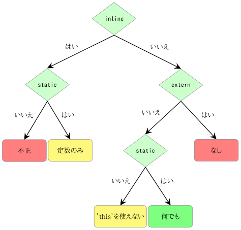

## 4.1 変数

変数フィールドについては、すでに前章でいくつかのサンプルコードで見てきました。変数フィールドは値を保持するもので、その性質はほとんどプロパティと共通しています(すべてでは無い)。

```haxe
class Main {
  static var member:String = "bar";

  public static function main() {
    trace(member);
    member = "foo";
    trace(member);
  }
}
```

ここから変数が以下のようなものだとわかります。

1. 名前を持つ(ここでは`member`),
2. 型を持つ(ここでは`String`),
3. 一定の初期値を持つ場合がある(ここでは`"bar"`) and
4. [アクセス修飾子](class-field-access-modifier.md)を持つ場合がある(ここでは`static`)

上の例は最初に`member`の初期値を出力した後、`"foo"`を割り当ててから新しい値を出力しています。アクセス修飾子の効果は3種類のクラスフィールドで共通しており、その内容については後の節で説明します。

変数フィールドが初期値をもつ場合には、型の明示は不要になります。この場合、コンパイラが[推論](type-system-type-inference.md)を行います。



_Figure: 変数フィールドの値の初期化_

---

Previous section: [クラスフィールド](class-field.md)

Next section: [プロパティ](class-field-property.md)