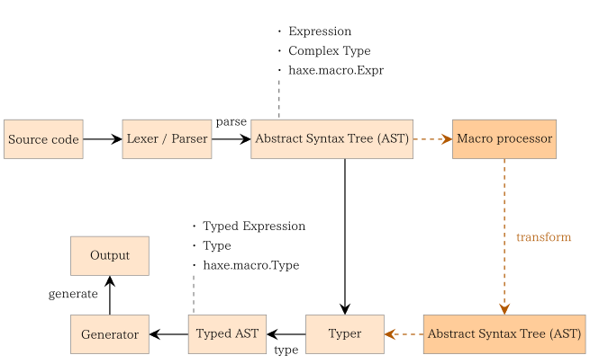

## 9 マクロ

マクロは疑いようもなくHaxeの最も高度な機能です。マクロは少数の精鋭にとってのみこれをマスターする価値があるので黒魔術と呼ばれることがありますが、実際には魔法のようなものは何もありません（もちろん闇も）。

> ##### Define: 抽象構文木（AST：Abstract Syntax Tree）
>
> 抽象構文木はHaxeのコードを構文解析して型付けされた構造へと変換した結果です。この構造はHaxe標準ライブラリの`haxe/macro/Expr.hx`ファイルで定義されている型をつかってマクロから利用可能です。

_Figure: コンパイルにおけるマクロの役割_

基本的なマクロの1つは**構文変形**です。これは0個以上の式を受け取り、1つの式を返します。マクロが呼び出されると、その結果としてマクロを呼び出した位置にコードが挿入されます。この点はプリプロセッサに似ていますが、Haxeのマクロはテキストの置換ツールではありません。

マクロには種類があり、それぞれ異なるコンパイルの段階で動作します。

* 初期化マクロ: コマンドラインから`--macro`コンパイラパラメータを使うことで使用します。コンパイラ引数が処理されて、**型付けコンテクスト**が作成されたあとに実行されます。ただし、これはどの型付けが実行されるよりも前です（詳しくは[初期化マクロ](macro-initialization.md)）。
* ビルドマクロ: クラス、列挙型、抽象型を`@:build`または`@:autoBuild`[メタデータ](lf-metadata.md)を使って定義します。その型の生成（クラスの継承関係などの他の型との依存関係の解決も含めて）後に型ごとに実行されます。ただし、これはフィールドが型付けされるよりは前です（詳しくは[型ビルド](macro-type-building.md)）。
* 式マクロ: 型付けされると同時に実行される普通の関数です。

---

Previous section: [RTTIの構造](cr-rtti-structure.md)

Next section: [マクロコンテクスト](macro-context.md)