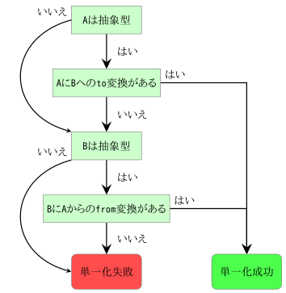

## 2.8.1 暗黙のキャスト

クラスとは異なり抽象型は暗黙のキャストを許します。抽象型には2種類の暗黙のキャストがあります。

* 直接: 他の型から抽象型への直接のキャストを許します。これは`to`と`from`のルールを抽象型に設定することでできます。 これは、その抽象型の基底型に単一化可能な型のみで利用可能です。
* クラスフィールド: 特殊なキャスト関数を呼び出すことによるキャストを許します。この関数は`@:to`と`@:from`のメタデータを使って定義されます。この種類のキャストは全ての型で利用可能です。

下のコードは、直接キャストの例です。

```haxe
abstract MyAbstract(Int) from Int to Int {
  inline function new(i:Int) {
    this = i;
  }
}

class Main {
  static public function main() {
    var a:MyAbstract = 12;
    var b:Int = a;
  }
}
```

`from Int`かつ`to Int`の`MyAbstract`を定義しました。これは`Int`を代入することが可能で、かつ`Int`に代入することが可能だという意味です。このことは、9、10行目に表れています。まず、`Int`の12を`MyAbstract`型の変数`a`に代入しています(これは`from Int`の宣言により可能になります)。そして次に、`Int`型の変数`b`に、抽象型のインスタンスを代入しています(これは`to Int`の宣言により可能になります)。

クラスフィールドのキャストも同じ意味を持ちますが、定義の仕方はまったく異なります。

```haxe
abstract MyAbstract(Int) {
  inline function new(i:Int) {
    this = i;
  }

  @:from
  static public function fromString(s:String) {
    return new MyAbstract(Std.parseInt(s));
  }

  @:to
  public function toArray() {
    return [this];
  }
}

class Main {
  static public function main() {
    var a:MyAbstract = "3";
    var b:Array<Int> = a;
    trace(b); // [3]
  }
}
```

静的な関数に`@:from`を付けることで、その引数の型からその抽象型への暗黙のキャストを行う関数として判断されます。この関数はその抽象型の値を返す必要があります。`static`を宣言する必要もあります。

同じように関数に`@:to`を付けることで、その抽象型からその戻り値の型への暗黙のキャストを行う関数として判断されます。この関数は普通はメンバ関数ですが、`static`でも構いません。そして、これは[選択的関数](types-abstract-selective-functions.md)として働きます。

上の例では、`fromString`メソッドが`"3"`の値を`MyAbstract`型の変数`a`への代入を可能にし、
`toArray`メソッドがその抽象型インスタンスを`Array<Int>`型の変数`b`への代入を可能にします。

この種類のキャストを使った場合、必要な場所でキャスト関数の呼び出しが発生します。このことはJavaScript出力を見ると明らかです。

```haxe
var a = _ImplicitCastField.MyAbstract_Impl_.fromString("3");
var b = _ImplicitCastField.MyAbstract_Impl_.toArray(a);
```

これは2つのキャスト関数で[インライン化](class-field-inline.md)を行うことでさらなる最適化を行うことができます。これにより出力は以下のように変わります。

```haxe
var a = Std.parseInt("3");
var b = [a];
```

型`A`から時の型`B`への代入の時にどちらかまたは両方が抽象型である場合に使われるキャストの**選択アルゴリズム**は簡単です。

1. `A`が抽象型でない場合は3へ。
2. `A`が、`B`**への**変換を持っている場合、これを適用して6へ。
3. `B`が抽象型でない場合は5へ。
4. `B`が、`A`**からの**変換を持っている場合、これを適用して6へ。
5. 単一化失敗で、終了。
6. 単一化成功で、終了。



_Figure: 選択アルゴリズムのフローチャート_

意図的に暗黙のキャストは連鎖的ではありません。これは以下の例でわかります。

```haxe
abstract A(Int) {
  public function new() this = 0;
  @:to public function toB() return new B();
}

abstract B(Int) {
  public function new() this = 0;
  @:to public function toC() return new C();
}

abstract C(Int) {
  public function new() this = 0;
}

class Main {
  static public function main() {
    var a = new A();
    var b:B = a; // valid, uses A.toB
    var c:C = b; // valid, uses B.toC
    var c:C = a; // error, A should be C
  }
}
```

`A`から`B`、`B`から`C`への個々のキャストは可能ですが、`A`から`C`への連鎖的なキャストはできません。これは、キャスト方法が複数生まれてしまうことは避けて、選択アルゴリズムの簡潔さを保つためです。

---

Previous section: [抽象型(abstract)](types-abstract.md)

Next section: [演算子オーバーロード](types-abstract-operator-overloading.md)